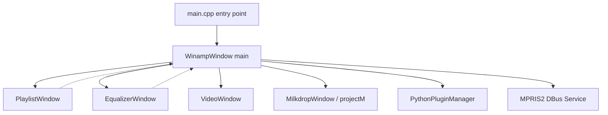

# Contributing to Winamp for Linux

Welcome! This guide outlines the development workflow, build system, testing infrastructure, and architecture overview for developers looking to contribute to Winamp-Linux.

---

## 1. Development Setup

### System Prerequisites
To compile the application, you need a C++17 compiler, CMake, and the appropriate developer packages.

On Debian/Ubuntu systems:
```bash
sudo apt-get update
sudo apt-get install -y \
    build-essential \
    cmake \
    ninja-build \
    file \
    dpkg-dev \
    qt6-base-dev \
    qt6-multimedia-dev \
    libqt6multimediawidgets6 \
    libprojectm-dev \
    projectm-data \
    python3
```

---

## 2. Compilation and Packaging

The codebase supports compilation against both Qt6 (default) and Qt5 (fallback).

### Building with Qt6 (Default)
```bash
cmake -S . -B build-qt6 -G Ninja
ninja -C build-qt6
```

### Building with Qt5 (Fallback)
If you need to build on a system without Qt6:
```bash
cmake -S . -B build-qt5 -G Ninja -DCMAKE_DISABLE_FIND_PACKAGE_Qt6=ON
ninja -C build-qt5
```

### Packaging via CPack
To compile the binaries and package them into a Debian (`.deb`) installer and a `.tar.gz` bundle:
```bash
ninja -C build-qt6 package
```
The resulting `.deb` package will be available in the `build-qt6` directory.

---

## 3. Running Tests

We use Qt Test and CTest for automated checks.

To run tests:
```bash
ctest --test-dir build-qt6 --output-on-failure
```
You can also run tests headlessly (useful for CI/CD) by using the offscreen platform integration:
```bash
QT_QPA_PLATFORM=offscreen ctest --test-dir build-qt6 --output-on-failure
```

---

## 4. Architecture Overview



### Main Components
- **`WinampWindow`** (`src/winamp_window.h`): The central orchestrator. Manages coordinate positions, the `QMediaPlayer` playback instance, volume, balance, skin styling transitions, and layouts.
- **`PlaylistWindow`** (`src/playlist.h` & `src/playlist.cpp`): Manages the queue of tracks. Supports custom list views, sorting (title, filename, path), file drops, and asynchronous duration probing.
- **`EqualizerWindow`** (`src/equalizer.h`): Interface for the graphic equalizer. Adjusts 10 discrete frequency bands, stores/loads presets, and routes EQ levels to the DSP.
- **`George Yohng's EQ10 DSP`** (`src/eq_dsp.h`): The actual DSP engine running in the audio stream path to process raw PCM float/int16 buffers.
- **`PythonPluginManager`** (`src/python_plugin.{h,cpp}`): Spawns an out-of-process `python3` host (JSON-RPC) that loads scripts from `~/.config/winamp/plugins/` and exposes the same API proxy methods formerly provided by embedded `winamp.Api`.

### Snapping & UI Window Mechanics
Sub-windows (Playlist, Equalizer) automatically snap to the edges of the main window when within a 15-pixel radius. Snapping alignment is maintained when dragging the main window around the desktop:
- Snapping logic is evaluated in `checkSnap()` when a sub-window dragging mouse event is released.
- The sub-window moves relative to the main window during the main window's dragging events via `followMain()`.

---

## 5. Coding Standards

- **Warning-Free Compilation**: All files must build with `-Wall -Wextra -Wpedantic` warnings enabled and zero warnings generated.
- **Security Hardening**: Code compiles with stack protection (`-fstack-protector-strong`) and buffer fortification (`_FORTIFY_SOURCE=2`). Avoid unsafe C-string copies (`strcpy`/`sprintf`); use safe Qt structures (`QString`, `QByteArray`) instead.
- **Header Decoupling**: Keep UI component declarations isolated. Avoid circular `#include` dependencies between headers. Use forward declarations (`class X;`) in header files wherever possible and move `#include "x.h"` imports to `.cpp` files.
- **Memory Hygiene**: Use Qt's parent-child ownership tree (passing `this` to constructors) so that the framework cleans up widget allocations automatically when windows are closed.
