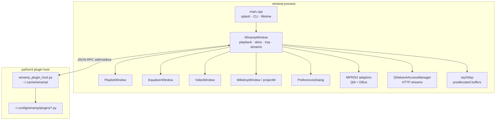

# Contributing to Winamp for Linux

Thank you for helping improve a native classic Winamp experience on Linux. This guide is the developer handbook: environment setup, build matrix, tests, packaging, architecture, and coding standards.

---

## Table of contents

1. [Code of collaboration](#1-code-of-collaboration)
2. [Development environment](#2-development-environment)
3. [Build matrix](#3-build-matrix)
4. [Tests](#4-tests)
5. [Packaging & release](#5-packaging--release)
6. [Architecture](#6-architecture)
7. [Coding standards](#7-coding-standards)
8. [Where to put changes](#8-where-to-put-changes)
9. [Pull request checklist](#9-pull-request-checklist)
10. [Debugging tips](#10-debugging-tips)

---

## 1. Code of collaboration

- Prefer **small, reviewable commits** with clear messages (what + why).
- Do **not** commit agent/IDE private instruction stores or vendor-named local harness directories.
- Match existing C++ style; do not reformat unrelated files.
- Do **not** change core playback / gapless logic unless the change is the explicit goal of the PR—audio path regressions are painful.
- Classic UI fidelity beats speculative “modernization” of chrome unless agreed.

---

## 2. Development environment

### Required tools

| Tool | Notes |
|------|--------|
| C++17 compiler | GCC or Clang |
| CMake ≥ 3.16 | Project minimum |
| Ninja | Recommended generator |
| Qt 6 **or** Qt 5 | Qt 6 preferred |
| `libprojectM` | Visualization |
| `python3` | Plugin host at runtime (interpreter on `PATH`) |

### Debian / Ubuntu packages

```bash
sudo apt-get update
sudo apt-get install -y \
  build-essential \
  cmake \
  ninja-build \
  file \
  dpkg-dev \
  qt6-base-dev \
  qt6-multimedia-dev \
  libqt6opengl6-dev \
  libqt6multimediawidgets6 \
  libgl-dev \
  libprojectm-dev \
  projectm-data \
  libtag1-dev \
  pkg-config \
  python3 \
  gstreamer1.0-plugins-good \
  gstreamer1.0-plugins-bad \
  gstreamer1.0-plugins-ugly \
  gstreamer1.0-libav
```

### Optional: Qt 5 toolchain

Install your distribution’s Qt 5 base + multimedia + widgets packages, then configure with `CMAKE_DISABLE_FIND_PACKAGE_Qt6=ON` (see below).

### Clone & first build

```bash
git clone https://github.com/lord3nd3r/winamp-linux.git
cd winamp-linux
cmake -S . -B build-qt6 -G Ninja -DCMAKE_BUILD_TYPE=Debug
ninja -C build-qt6
./build-qt6/winamp
```

Use `Debug` while developing; use `Release` for packaging benchmarks.

---

## 3. Build matrix

### Qt 6 (default)

```bash
cmake -S . -B build-qt6 -G Ninja -DCMAKE_BUILD_TYPE=Debug
ninja -C build-qt6
```

Enables the full feature set when DBus is present: MPRIS2, modern multimedia APIs, EQ audio buffer path (version-gated).

### Qt 5 (fallback)

```bash
cmake -S . -B build-qt5 -G Ninja \
  -DCMAKE_DISABLE_FIND_PACKAGE_Qt6=ON \
  -DCMAKE_BUILD_TYPE=Debug
ninja -C build-qt5
```

Expect:

- MPRIS2 disabled
- Some Qt 6–only multimedia APIs compiled out via `compat.h` / version checks

### Compiler flags (always on for `winamp` target)

| Flag / define | Purpose |
|---------------|---------|
| `-Wall -Wextra -Wpedantic` | Warning surface |
| `-Wno-unused-parameter` | Qt slot signatures |
| `-fstack-protector-strong` | Stack hardening |
| `_FORTIFY_SOURCE=2` | Fortified libc checks |

**Policy:** zero warnings on both Qt 5 and Qt 6 configurations.

### Useful CMake toggles

| Variable | Effect |
|----------|--------|
| `CMAKE_BUILD_TYPE` | `Debug` / `Release` / `RelWithDebInfo` |
| `CMAKE_DISABLE_FIND_PACKAGE_Qt6=ON` | Force Qt 5 path |
| `CMAKE_INSTALL_PREFIX` | Install root |

---

## 4. Tests

Tests use **Qt Test** and are registered with **CTest**.

```bash
# After configuring build-qt6
ninja -C build-qt6
ctest --test-dir build-qt6 --output-on-failure

# Individual binaries
./build-qt6/winamp_tests
./build-qt6/playlist_tests

# Offscreen (CI / headless SSH)
QT_QPA_PLATFORM=offscreen ctest --test-dir build-qt6 --output-on-failure
```

| Target | Sources | What it asserts |
|--------|---------|-----------------|
| `winamp_tests` / `eq_dsp_test` | `tests/test_eq_dsp.cpp` | dB conversion, setup, gains, process path |
| `playlist_tests` / `playlist_test` | `tests/test_playlist.cpp` + playlist/eq/prefs/video objs | Add/clear, navigation, sort, selection, dead file removal, async folder add |

### Adding tests

1. Prefer behavior/contract tests over snapshotting private implementation details.
2. Register with `add_executable` + `add_test` in `CMakeLists.txt`.
3. Keep tests free of network dependency unless mocked.
4. For UI-adjacent code, extract pure logic where possible so Qt Test can host it without full `WinampWindow`.

---

## 5. Packaging & release

### Local CPack

```bash
# Debian / Ubuntu (default: DEB + TGZ)
cmake -S . -B build-qt6 -G Ninja -DCMAKE_BUILD_TYPE=Release \
  -DWINAMP_DISTRO_ID=ubuntu-24.04
ninja -C build-qt6 package
ls -la build-qt6/winamp-*

# Fedora / openSUSE (RPM + TGZ; needs rpm-build)
cmake -S . -B build-rpm -G Ninja -DCMAKE_BUILD_TYPE=Release \
  -DWINAMP_DISTRO_ID=fedora-41 \
  -DCPACK_GENERATOR="RPM;TGZ"
ninja -C build-rpm package
```

| CMake option | Purpose |
|--------------|---------|
| `WINAMP_DISTRO_ID` | Suffix in package filenames (default `linux`) |
| `CPACK_GENERATOR` | `DEB;TGZ` (default) or `RPM;TGZ` |

CPack metadata lives in `CMakeLists.txt` (DEB shlibdeps, RPM autoreq, license, contact).

### GitHub Actions

| Workflow | Path | Trigger | What it does |
|----------|------|---------|--------------|
| **CI** | `.github/workflows/ci.yml` | Push / PR → `master` | Build + `ctest` on a representative distro matrix |
| **Release** | `.github/workflows/release.yml` | Tags `v*`, `workflow_dispatch` | Full package matrix → artifacts; on tags, attach to GitHub Release |

**Release matrix (packages):**

| Distro ID | Image | Package |
|-----------|-------|---------|
| `ubuntu-22.04` | `ubuntu:22.04` | `.deb` + `.tar.gz` |
| `ubuntu-24.04` | `ubuntu:24.04` | `.deb` + `.tar.gz` |
| `ubuntu-resolute` | `ubuntu:resolute` | `.deb` + `.tar.gz` |
| `debian-bookworm` | `debian:bookworm` | `.deb` + `.tar.gz` |
| `debian-trixie` | `debian:trixie` | `.deb` + `.tar.gz` |
| `fedora-41` | `fedora:41` | `.rpm` + `.tar.gz` |
| `fedora-42` | `fedora:42` | `.rpm` + `.tar.gz` |
| `opensuse-tumbleweed` | `opensuse/tumbleweed` | `.rpm` + `.tar.gz` |

CI uses a smaller matrix (Ubuntu 22.04/24.04, Debian Bookworm, Fedora 41, openSUSE Tumbleweed) for faster PR feedback.

**Arch Linux** is intentionally not in the matrix: distro packages only ship **projectM 4.x**, while Milkdrop support uses the classic 3.x API (`libprojectM/projectM.hpp`).

### Version

`project(Winamp VERSION 1.1.1 ...)` in `CMakeLists.txt` plus `WINAMP_VERSION_FULL` (`1.1.1`) and `kWinampVersion` in `src/constants.h` must stay aligned with **GitHub release tags**. Bump all three when cutting a release.

---

## 6. Architecture

### Runtime topology



### Component map

| Component | Location | Responsibility |
|-----------|----------|----------------|
| Entry / CLI | `src/main.cpp` | `QApplication`, splash, skin bootstrap, CLI args, owns `PythonPluginManager` |
| Main chrome | `src/winamp_window.h` | Player(s), volume/balance, skin painting, tray, HTTP streams, settings save/load |
| Playlist | `src/playlist.{h,cpp}` | Track list, sort, drop, async folder + duration probe |
| Equalizer UI | `src/equalizer.{h,cpp}` | 10 bands + preamp UI, snap-to-main |
| EQ DSP | `src/eq_dsp.h` | EQ10 processing |
| Plugins | `src/python_plugin.{h,cpp}` | Spawn host, dispatch RPC methods |
| Preferences | `src/preferences.{h,cpp}` | Settings UI + plugin manager |
| Video | `src/video.{h,cpp}` | `QVideoWidget` host |
| Visualization | `src/milkdrop.h` | projectM GL window |
| Media library | `src/media_library.h` | Filesystem browser |
| MPRIS2 | `src/mpris2_adaptors.h` | DBus root + player adaptors |
| Modern skins | `src/modern_skin.h` | XML skin parse (depth/cycle guarded) |
| Qt compat | `src/compat.h` | Qt5/Qt6 shims |
| Constants | `src/constants.h` | Layout tables, vis colors, built-in EQ presets |

### Audio path (conceptual)

1. `QMediaPlayer` decodes via the platform multimedia backend.
2. Optional Qt 6 audio buffer path feeds spectrum FFT and EQ processing.
3. EQ uses fixed buffers inside `eq_dsp.h` — **do not allocate on the hot path**.
4. Gapless: secondary player preloads the next playlist item; swap on near-end / end.

### Plugin path

1. `PythonPluginManager` writes host script to `~/.cache/winamp/winamp_plugin_host.py`.
2. Starts `python3` with that script.
3. Sends `{"type":"event","name":"start"}`; host imports each `*.py` plugin.
4. Plugin API calls become JSON request/notification lines; C++ handles them on the GUI thread and replies when needed.
5. On shutdown: `exit` event, then terminate/kill if needed.

### Window snapping

- Child windows snap within a pixel threshold of the main window edges.
- Dragging the main window repositions snapped children (`followMain` / `checkSnap` style logic).
- Snap state is persisted with window geometry in `winamp.conf`.

---

## 7. Coding standards

| Rule | Detail |
|------|--------|
| **Language** | C++17 |
| **Framework** | Qt 5 *and* Qt 6 must keep compiling |
| **Warnings** | Zero warnings with project flags |
| **Strings / I/O** | Prefer `QString`, `QByteArray`, Qt file APIs over raw C string sinks |
| **Ownership** | Qt parent-child tree (`new Widget(this)`); `WA_DeleteOnClose` for ephemeral dialogs |
| **Headers** | Forward-declare in headers; include in `.cpp` when practical |
| **Audio** | No unbounded locks or heap allocation in DSP process loops |
| **Modern skins** | Do not force-enable modern skins by default (classic is primary) |
| **Plugins** | Keep public API method names stable; document changes in `PLUGIN_DEVELOPMENT.md` |

### Style

- Match surrounding file indentation and naming.
- Avoid drive-by renames that churn blame without behavior change.
- New modules: prefer `.h` + `.cpp` over growing `winamp_window.h` further when feasible.

---

## 8. Where to put changes

| Kind of change | Primary files |
|----------------|---------------|
| Main window chrome / playback orchestration | `winamp_window.h` |
| Playlist behavior | `playlist.{h,cpp}` |
| EQ UI | `equalizer.{h,cpp}` |
| EQ math | `eq_dsp.h` + `tests/test_eq_dsp.cpp` |
| Plugin host / API surface | `python_plugin.{h,cpp}` + plugin docs |
| Preferences pages | `preferences.{h,cpp}` |
| Network stream policy | `playHttpStream` in `winamp_window.h` |
| Skin constants / vis colors | `constants.h`, `winamp_bitmaps.h` |
| Build / deps / install | `CMakeLists.txt` |
| User docs | `README.md`, `CONFIGURATION.md`, `PLUGIN_DEVELOPMENT.md` |

---

## 9. Pull request checklist

- [ ] Builds on **Qt 6** (`build-qt6`)
- [ ] Builds on **Qt 5** if you touched `compat.h`, multimedia ifdefs, or shared headers
- [ ] `ctest --test-dir build-qt6 --output-on-failure` passes
- [ ] No new compiler warnings
- [ ] No secrets, absolute personal paths, or private agent files
- [ ] Docs updated when user-visible behavior or API changes
- [ ] Audio/gapless changes include a short test plan in the PR description

---

## 10. Debugging tips

```bash
# Verbose Qt logging
QT_LOGGING_RULES="*.debug=true" ./build-qt6/winamp

# Plugin host diagnostics (stderr from host + plugins)
./build-qt6/winamp 2>&1 | grep -E 'Python|Plugin'

# Reset user config (destructive to your local settings)
mv ~/.config/winamp ~/.config/winamp.bak.$(date +%s)
```

| Symptom | Things to check |
|---------|-----------------|
| No sound / short formats fail | GStreamer plugin packages; try another file type |
| Plugins not loading | `python3` on `PATH`; files under `~/.config/winamp/plugins/*.py`; look for `[Plugin Host]` lines |
| MPRIS / media keys dead | Qt 6 build? `Qt6DBus` found at configure time? |
| Visualization blank | `libprojectM` + `projectm-data` installed |
| Skin looks wrong | Classic vs modern path; bitmap load paths in `WinampBitmaps::loadAll` |

---

## License of contributions

By contributing, you agree that your contributions are licensed under the same **GPL-2.0** terms as the project (`LICENSE.md`).
