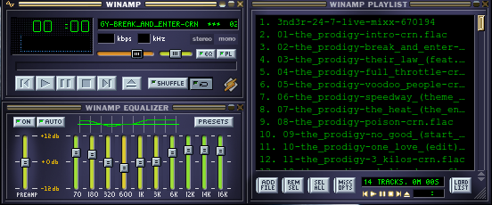

# Winamp for Linux

**A native classic Winamp 2.x–style media player for modern Linux desktops.**

**Current release: [v1.2.1](https://github.com/lord3nd3r/winamp-linux/releases/tag/v1.2.1)**

Built in **C++17** with **Qt 6** (Qt 5 fallback), faithful classic skins, a real 10-band EQ, gapless dual-player audio, out-of-process Python plugins, and desktop integration via MPRIS2.

<p align="center">
  
</p>

<p align="center">
  
  
  
  
  
</p>

<p align="center">
  <a href="#quick-start">Quick start</a> ·
  <a href="#features">Features</a> ·
  <a href="#documentation">Docs</a> ·
  <a href="#command-line">CLI</a> ·
  <a href="#repository-layout">Layout</a> ·
  <a href="#license">License</a>
</p>

---

## Why this project?

Classic Winamp defined how a generation listened to music on the desktop: skinnable chrome, a green spectrum, an always-there playlist editor, and an EQ that actually changed the sound. **Winamp for Linux** brings that workflow to native Linux without a Windows compatibility layer—same interaction model, modern backends (GStreamer / FFmpeg via Qt Multimedia), and safe extensibility through sandboxed Python plugins.

---

## Features

### Playback & audio
| Feature | Details |
|---------|---------|
| **Local media** | Plays common audio/video formats supported by the Qt Multimedia backend (typically GStreamer or FFmpeg on Linux). |
| **ID3 tags (Winamp 2.x)** | Full **read/write** via TagLib: File Info (Alt+3), ID3v1+ID3v2 on MP3, playlist “Artist - Title”, sort by title. |
| **Gapless dual-player** | Next track is preloaded on a second `QMediaPlayer` and swapped at end-of-track to reduce silence between songs. |
| **URL / radio streams** | HTTP(S) and related schemes via `QNetworkAccessManager`, with redirect limits and request timeouts. |
| **Volume & balance** | Classic 0–255 volume scale and stereo balance, persisted across sessions. |
| **Shuffle / repeat** | Playlist shuffle, playlist repeat, and single-track repeat. |
| **Stop after current** | Optional stop when the playing track ends. |

### Classic UI & skins
| Feature | Details |
|---------|---------|
| **Classic skin engine** | Loads classic Winamp bitmaps (folder, or `.wsz` / `.zip` skin packs where supported). |
| **Default skin** | Ships with classic assets under `assets/` and `skins/default/`. |
| **Window snapping** | Main, equalizer, and playlist windows snap and follow each other like the original. |
| **Double size & shade** | Double-size mode and shade (title-bar compact) modes. |
| **Always on top** | Optional stay-on-top for the main window. |
| **System tray** | Tray icon, minimize-to-tray options, and song-change notifications. |
| **Spectrum analyzer** | Logarithmic spectrum matching classic Winamp band mapping (`sa_tab[]`-style distribution). |

### Equalizer
| Feature | Details |
|---------|---------|
| **10-band graphic EQ** | Bands aligned with classic Winamp (≈60 Hz … 16 kHz). |
| **EQ10 DSP** | Port of **George Yohng’s EQ10** algorithm with preamp and asymmetric Q. |
| **Presets** | Built-in and user-facing preset workflow from the equalizer UI. |
| **Glitch-conscious path** | Pre-allocated DSP buffers on the real-time path (no heap churn in the audio process loop). |

### Extensibility & desktop
| Feature | Details |
|---------|---------|
| **Python plugins** | Out-of-process `python3` host, JSON-RPC over stdin/stdout. A bad plugin cannot crash the player process. |
| **Plugin manager UI** | Preferences → Plug-ins: enable/disable, add, remove, open config. |
| **Example plugins** | `hello_winamp.py`, production-oriented `icecast_dj.py` (Icecast via `ffmpeg`). |
| **MPRIS2** | Media keys, lock-screen controls, KDE Connect–style clients (**Qt 6 + Qt DBus**). |
| **Milkdrop / projectM** | Visualization via `libprojectM` when available. |
| **Video window** | Video surface for video tracks. |
| **Media library browser** | Filesystem-oriented media browser window. |
| **Localization** | Language packs under `lang/` (e.g. German, Spanish). |
| **Bookmarks & recent files** | Bookmarked paths/URLs and recent-file history. |

---

## Documentation

| Guide | What it covers |
|-------|----------------|
| **[CONTRIBUTING.md](CONTRIBUTING.md)** | Dependencies, Qt 5/6 builds, tests, packaging, architecture, coding standards, PR workflow |
| **[CONFIGURATION.md](CONFIGURATION.md)** | Paths, `winamp.conf` keys (verified against source), skins, plugins dir, bookmarks |
| **[PLUGIN_DEVELOPMENT.md](PLUGIN_DEVELOPMENT.md)** | Sandbox model, lifecycle hooks, full API reference, examples, Icecast DJ notes |
| **[winamp.png](winamp.png)** | README hero screenshot (classic main + equalizer) |

---

## Quick start

### Runtime dependencies (playback)

Decoding is provided by the Qt Multimedia backend. On most Debian/Ubuntu systems install GStreamer plugins:

```bash
sudo apt-get install -y \
  gstreamer1.0-plugins-good \
  gstreamer1.0-plugins-bad \
  gstreamer1.0-plugins-ugly \
  gstreamer1.0-libav
```

### Build dependencies (Debian / Ubuntu)

```bash
sudo apt-get update
sudo apt-get install -y \
  build-essential \
  cmake \
  ninja-build \
  qt6-base-dev \
  qt6-multimedia-dev \
  libqt6opengl6-dev \
  libqt6multimediawidgets6 \
  libgl-dev \
  libprojectm-dev \
  projectm-data \
  libtag1-dev \
  pkg-config \
  python3 \
  file \
  dpkg-dev
```

| Package | Role |
|---------|------|
| `qt6-base-dev`, `libqt6opengl6-dev`, multimedia | UI + OpenGL + playback |
| `libprojectm-dev`, `projectm-data` | Milkdrop-compatible visualizations |
| `libtag1-dev` | ID3v1/v2 + multi-format tag **read and write** (File Info / Alt+3) |
| `python3` | Out-of-process plugin host (not linked into the binary) |
| `file`, `dpkg-dev` | CPack `.deb` packaging helpers |

### Build (Qt 6 — preferred)

```bash
cmake -S . -B build-qt6 -G Ninja -DCMAKE_BUILD_TYPE=Release
ninja -C build-qt6
./build-qt6/winamp
```

### Build (Qt 5 — fallback)

```bash
cmake -S . -B build-qt5 -G Ninja \
  -DCMAKE_DISABLE_FIND_PACKAGE_Qt6=ON \
  -DCMAKE_BUILD_TYPE=Release
ninja -C build-qt5
./build-qt5/winamp
```

Qt 5 builds disable MPRIS2 (DBus media player interface is Qt 6–oriented in this tree).

### Tests

```bash
ctest --test-dir build-qt6 --output-on-failure
# Headless / CI:
QT_QPA_PLATFORM=offscreen ctest --test-dir build-qt6 --output-on-failure
```

| Test target | Coverage |
|-------------|----------|
| `eq_dsp_test` | EQ helpers and process path (`tests/test_eq_dsp.cpp`) |
| `playlist_test` | Playlist ops, selection, async folder add (`tests/test_playlist.cpp`) |

### Install / package

```bash
# Install into a prefix (example)
cmake --install build-qt6 --prefix /usr/local

# Or build distribution packages (DEB + TGZ by default)
ninja -C build-qt6 package
# → build-qt6/winamp-*.deb and .tar.gz

# RPM (Fedora / openSUSE) — needs rpm-build installed
cmake -S . -B build-rpm -G Ninja -DCMAKE_BUILD_TYPE=Release \
  -DWINAMP_DISTRO_ID=fedora-41 -DCPACK_GENERATOR="RPM;TGZ"
ninja -C build-rpm package
```

Default install layout (CMake `install` rules):

| Path | Content |
|------|---------|
| `bin/winamp` | Executable |
| `share/applications/winamp.desktop` | Desktop entry |
| `share/icons/hicolor/*/apps/winamp.png` | Themed app icon (16-256px) |
| `share/winamp/skins/` | Skins |
| `share/winamp/resource/` | Classic resource bitmaps |
| `share/winamp/lang/` | Language packs |

### GitHub multi-distro builds

| Workflow | When | Distros |
|----------|------|---------|
| **CI** (`.github/workflows/ci.yml`) | Push / PR to `master` | Ubuntu 22.04 & 24.04, Debian Bookworm, Fedora 41, openSUSE Tumbleweed — build + test |
| **Release** (`.github/workflows/release.yml`) | Tags `v*` or manual dispatch | Ubuntu 22.04 / 24.04 / Resolute, Debian Bookworm / Trixie, Fedora 41 / 42, openSUSE Tumbleweed — package + upload |

Release assets are named per distro, for example:

- `winamp-1.2.1-ubuntu-24.04.deb`
- `winamp-1.2.1-fedora-41.rpm`
- matching `.tar.gz` for each matrix entry

**Not packaged in CI:** Arch Linux (repo only ships **projectM 4.x**; this tree still uses the classic 3.x `libprojectM` C++ API). Build from source on Arch once a compatible `libprojectM` is available, or vendor the 3.x library.

### Containerized package build

```bash
docker run --rm -it -v "$(pwd)":/workspace -w /workspace ubuntu:24.04 bash
# inside:
apt-get update && apt-get install -y \
  cmake ninja-build build-essential \
  qt6-base-dev qt6-multimedia-dev \
  libprojectm-dev projectm-data python3 \
  libgstreamer1.0-dev libgstreamer-plugins-base1.0-dev \
  libgl1-mesa-dev file dpkg-dev git
cmake -S . -B build -G Ninja -DCMAKE_BUILD_TYPE=Release \
  -DWINAMP_DISTRO_ID=ubuntu-24.04
ninja -C build package
```

---

## Command line

```text
winamp [options] [files-or-directories...]
```

| Argument | Behavior |
|----------|----------|
| *file* | Add to playlist; plays the first file unless `-enqueue` |
| *directory* | Scan/add folder asynchronously |
| `-enqueue` / `--enqueue` | Add only; do not auto-start playback |
| `-play` / `--play` | Prefer play after enqueue (default for files) |
| `-pause` / `--pause` | Pause if currently playing |
| `-stop` / `--stop` | Stop playback |

Examples:

```bash
./build-qt6/winamp ~/Music/album/*.flac
./build-qt6/winamp -enqueue ~/Music/incoming/
./build-qt6/winamp "https://example.com/stream.mp3"
```

---

## Python plugins (overview)

Plugins live in:

```text
~/.config/winamp/plugins/*.py
```

They run inside a **separate `python3` process**. The player generates a host script under the cache directory and speaks JSON-RPC on stdin/stdout. Prefer `print(..., file=sys.stderr)` so logs never corrupt the control channel.

Minimal plugin:

```python
def on_winamp_start(api):
    import sys
    print(f"volume={api.get_volume()}", file=sys.stderr)

def on_winamp_exit():
    pass
```

Full API, lifecycle rules, and the Icecast DJ example: **[PLUGIN_DEVELOPMENT.md](PLUGIN_DEVELOPMENT.md)**.

---

## Configuration (overview)

| Path | Purpose |
|------|---------|
| `~/.config/winamp/winamp.conf` | Main INI settings (geometry, playback, EQ, playlist) |
| `~/.config/winamp/plugins/` | User Python plugins |
| `~/.config/winamp/bookmarks.txt` | Bookmarks |
| `~/.cache/winamp/` | Generated plugin host script (not user-edited) |
| `/usr/share/winamp/` | System skins, resources, languages (when installed) |

Full key reference: **[CONFIGURATION.md](CONFIGURATION.md)**.

---

## Repository layout

```text
winamp-linux/
├── src/
│   ├── main.cpp              # App entry, splash, CLI, plugin manager lifetime
│   ├── winamp_window.h       # Main window, playback, skins, network streams
│   ├── playlist.{h,cpp}      # Playlist editor + async metadata
│   ├── equalizer.{h,cpp}     # EQ UI
│   ├── eq_dsp.h              # EQ10 DSP core
│   ├── python_plugin.{h,cpp} # Out-of-process plugin host
│   ├── preferences.{h,cpp}   # Preferences dialog (incl. plugin manager)
│   ├── video.{h,cpp}         # Video window
│   ├── milkdrop.h            # projectM visualization window
│   ├── media_library.h       # Media library browser
│   ├── mpris2_adaptors.h     # MPRIS2 DBus (Qt6)
│   ├── modern_skin.h         # Modern skin XML (depth-limited includes)
│   ├── dialogs.h             # File info, open URL, search, about, …
│   ├── constants.h           # Layout constants, vis colors, presets
│   ├── compat.h              # Qt5/Qt6 compatibility shims
│   └── …
├── tests/                    # Qt Test suites
├── plugins/examples/         # Example Python plugins
├── skins/default/            # Default classic skin files
├── assets/                   # Classic resource bitmaps / icons
├── icons/hicolor/            # Themed app icon (installed to share/icons)
├── lang/                     # Translation packs
├── docs/images/              # Extra documentation illustrations
├── winamp.png                # README hero (classic main + equalizer)
├── CMakeLists.txt
└── winamp.desktop
```

Architecture diagram and contribution workflow: **[CONTRIBUTING.md](CONTRIBUTING.md)**.

---

## Security & hardening notes

- Compiler flags: `-Wall -Wextra -Wpedantic`, `-fstack-protector-strong`, `_FORTIFY_SOURCE=2`.
- HTTP streams: redirect policy + max redirects (5) + transfer timeout (15s).
- Modern skin XML: include recursion depth limit and circular-include detection.
- Python plugins: process isolation (crash boundary). Plugins still have full OS privileges of the `python3` user process—treat third-party plugins like any untrusted script.

---

## Roadmap-style known limits

These are intentional or inherited constraints, not silent omissions:

- **Classic skins first** — modern Winamp 5 skin support is limited; classic is the primary path.
- **MPRIS2 on Qt 6 only** — Qt 5 builds skip the DBus media player interface.
- **Plugin sandbox** — process isolation, not full OS sandbox (no seccomp/cgroup jail by default).
- **Test surface** — EQ DSP and playlist logic covered; full UI automation is not yet in-tree.

---

## License

This project is licensed under the **[GNU General Public License v2.0](LICENSE.md)**.

Classic Winamp is a trademark of its respective owners. This project is an independent Linux reimplementation inspired by the classic player; it is not affiliated with or endorsed by the original Winamp vendors.

---

## Credits

- Classic Winamp UX — the original Nullsoft Winamp 2.x design language
- **George Yohng** — EQ10 equalizer algorithm (ported in `eq_dsp.h`)
- **projectM** — Milkdrop-compatible visualization engine
- **Qt Project** — application framework and multimedia stack
- Contributors to this repository and its example plugins
